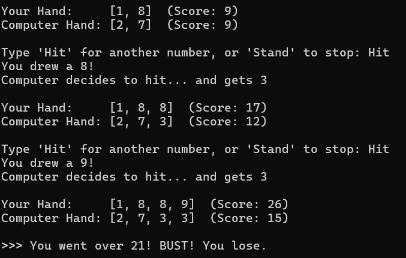

**Fun Number Game**

**Overview**

Fun Number Game is a lightweight, text-based strategy game developed in Python. It is a simplified variation of the classic casino game Blackjack. Instead of using a standard deck of cards with suits and face values, this game uses simple random digits between 1 and 10. The goal is to reach a score of 21 without going over (Busting), while competing against a computer opponent that follows strict casino-style rules.

This project was built to demonstrate core programming concepts such as control flow (loops, conditionals), state management, and random number generation in a clean, executable format.

**Features**

- **Simplified Rules:** Uses digits 1-10 (no face cards or complex Ace logic).
- **Smart Computer Opponent:** The computer plays alongside you, hitting until it reaches 17 or higher.
- **Instant Win Logic:** Specific checks for "Instant 21" victories add tension to the gameplay.
- **Dynamic Game Loop:** The computer can react and "catch up" even after the player stands.
- **Cross-Platform Interface:** Automatically detects the operating system (Windows/Mac/Linux) to clear the console screen correctly between rounds.
- **Replayability:** Allows continuous play without restarting the script.

**Technologies & Tools Used**

- **Language:** Python 3.x
- **Libraries:**
  - random (Standard Library): For generating random digits.
  - os (Standard Library): For handling console clear commands.
- **Interface:** Command Line Interface (CLI) / Terminal.

**Steps to Install & Run**

**Prerequisites**

- You must have **Python 3** installed on your system. You can verify this by typing python --version or python3 --version in your terminal.

**Installation**

- Download the Code:

Save the game script as digit_blackjack.py.

- Open Terminal:

Navigate to the folder where you saved the file using your command line (Command Prompt, PowerShell, or Terminal).

**Running the Game**

Run the following command in your terminal:

python digit_blackjack.py

_(Note: On some Mac/Linux systems, you might need to use python3 digit_blackjack.py)_

**Instructions for Testing**

Since this is a CLI game involving randomness, testing is primarily manual. Follow these scenarios to ensure the game logic works correctly:

- **The "Bust" Test:**
  - Run the game.
  - Continually type Hit regardless of your score.
  - **Expected Result:** Verify that once your score exceeds 21, the game immediately declares "You went over 21! BUST! You lose." and ends the round.
- **The "Stand" Test:**
  - Run the game.
  - Type Stand on your very first turn (or after one safe hit).
  - **Expected Result:** The game should switch to the Computer's turn. The computer should continue to draw numbers until its total is **17 or higher**.
- **The Input Validation Test:**
  - When asked to Hit or Stand, type invalid inputs like "hello", "123", or leave it blank.
  - **Expected Result:** The game should print "I didn't understand that" and ask for input again, without crashing.
- **The "Draw" Scenario (Rare):**
  - This may require multiple attempts. Try to get a score of 21.
  - If the computer also gets 21.
  - **Expected Result:** The game should declare "Both hit 21! It's a Draw!" rather than a computer win.

**Screenshots (Test Results):**

_Result of Test 1: The "Bust" Test_

_Result of Test 2: The "Stand" Test_

_Result of Test 3: The Input Validation Test_

_Result of Test 4: The "Draw" Scenario_

